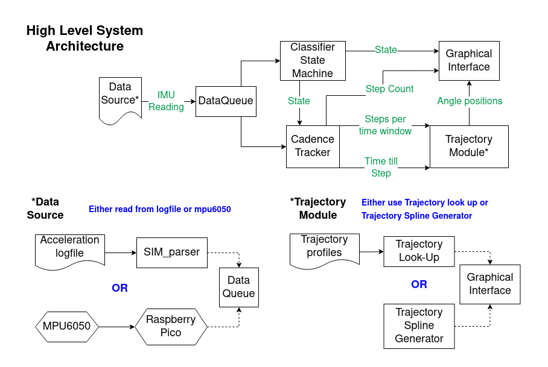
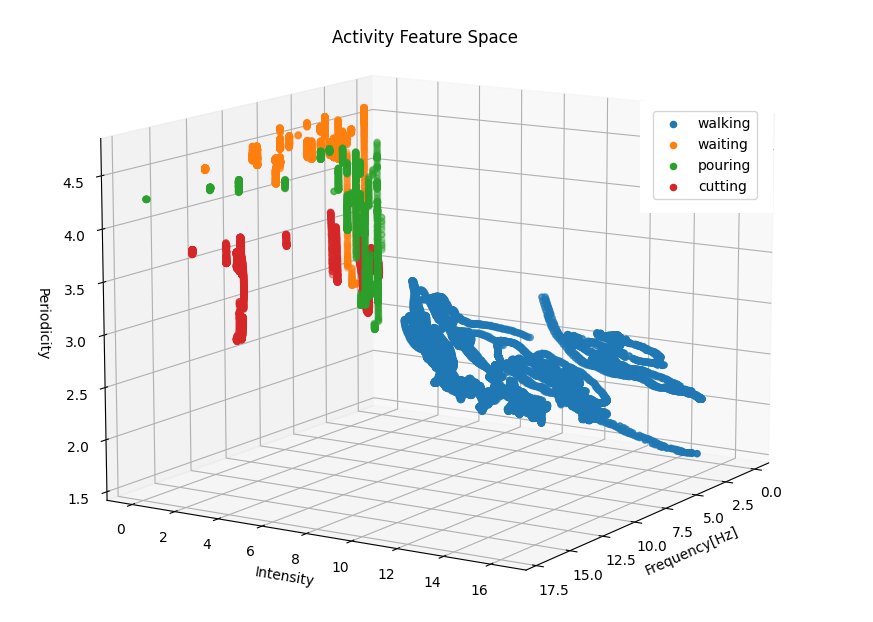
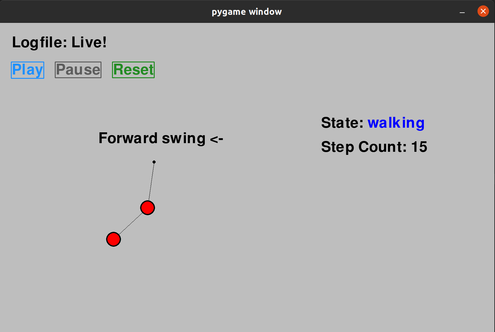
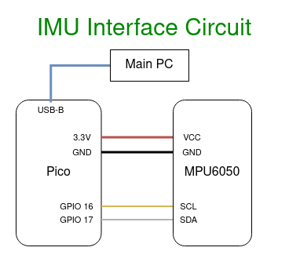

# Cadence Tracker Visualizer

This project showcases how using a single inertial measurement unit on a
patient's elbow can be used to form trajectories of a prothestic arm. 
The inertial measurement unit(IMU) is used to capture accelerations on 
the elbow of a patient. These accelerations are utilized to derive what activity
the patient is performing. Further, if the patient is walking, ground reaction 
forces captured by the IMU will imply a step cadence. Finally, a trajectory is
crafted such that the apex of the arm swing matches the step cadence.



There are five major software modules used for this process. The IMU interface
device responsible for capturing acceleration on the patient's elbow. A 
classifier state machine that can identify if the patient is walking or not. A
cadence tracker that counts the number of steps taken, predicts when the next
step will take place, and estimates a notional walk speed. A trajectory module
which uses the walk speed and current angles to output a desired angle.
Lastly, a graphic interface to showcase the arm's motion via a single or double
pendulum.

## Running the project

The main script of the project is the `run_sil.py` script at the root level of 
the repository. This script allows you to either playback a logfile of 
acceleration measurements or read measurements from an IMU. By using the command 
`./run_sil.py --help` you can see all of the arguments to the script to better 
customize a playback or live session. 

The required arguments are a `data_source` and `modelfile`. The `data_source` is
either a logfile following the [SIM format](#data-handling) or the port 
connecting to the IMU serial connection. To tell the script you're connecting
to the IMU instead of reading from a logfile, use the `-p` or `--port` option.

If the script reads from a logfile, it will simulate a live session by taking
each measurement in the file as an input into the main execution loop. This loop
will classify the activity being performed. If it concludes the activity is
walking, a cadence is calculated and used to return angle setpoints for the 
arm. Once the script is done processing the logfile, a simple graphical 
interface will appear to show how an arm would move given the data.

If the script is reading from an IMU, it will perform the same execution loop 
and show the arm live on the graphical interface. 

The `modelfile` argument is a filepath to the classifier that should be used
during execution. There are some defaults in the `models` directory. Refer to 
the [classifier training](#training-a-classifier) section for more detail.

Below is an example of running the program with a binary classifier using the 
IMU

`./run_sil.py -p -d /dev/ttyACM0 models/RKS_FINAL_BIN.joblib`

## Setup

This majority of this project was implemented in python 3.8.10. The following 
are required external dependencies:

* **numpy**: ver 1.21.4
* **scipy**: ver 1.7.2
* **pandas**: ver 1.3.5
* **matplotlib**: ver 3.6.1
* **pygame**: ver 2.1.0
* **pyserial**: ver 3.4
* **scikit-learn**: ver 1.1.2

Each of these packages can be installed in using the `pip install [package]` 
command in the terminal window.

## Training a Classifier

For this project, the classifier reads a small snippet of acceleration data
to determine which activity that data represents. Three features are derived 
from the acceleration data and placed into a k nearest neighbors(KNN) model to 
determine the activity. The features we use are the dominant frequency of the 
data, the signal power or intensity at the dominant frequency, and the entropy 
of the frequency transform of the data. 

The project's training process takes a collection of logfiles and shreds them
into small fragments roughly two to three seconds long. These fragments 
represent the input into the KNN classifier. From each fragment, we acquire the 
three features and assign the fragment a label representing the activity being 
performed at the time. These new features are collected into a feature set, 
a collection of points in the feature space with assigned labels. 



During execution, a KNN classifier takes an input of acceleration data, extracts 
the features and, plots this new point in the feature space. It then compares 
the k closest neighbors to the new point to provide a classification of what 
activity the input represents. 

In the `scripts` directory of the project is the `train_knn.py`. This scirpt
takes a training directory and trains a new KNN classifier. Use the `--help` 
option to see the arguments for creating a classifier. Particularly useful is 
`-f` option to see the feature space and the `-s` option to save the model in 
the `models` directory.

There are some existing models in the `models` directory. Each model's data
can be loaded using the `load()` from the built-in python `joblib` module. The
model's data contains a dictionary with the model and type of classifier, 
a dictionary of metrics (e.g. accuracy) of the model, and metadata comprising of
the training features with the date and version of this project when the model
was generated.

## Data Handling

The acceleration logfile are arranged in a SIM file format. These files are 
indicated using the prefix "SIM_" in the filename. The format is fairly straight
forward, the first four lines contain the date the file was generated, the units
of time and accelerations, the action being performed in the file, and the 
sample rate of the data collected. 

Afterward is five columns representing the frame number, time stamp, and 
acceleration components of X, Y, and Z. Below is an example file:

```
//Date Created 2022-12-08 15:48:07.130657
"//Units: sec, m/s/s"
Action,waiting
SampleRate,100.0
Frames#,Time,AccX,AccY,AccZ
1,4.0531158447265625e-06,-0.595608,9.551256,1.526096
2,0.0021212100982666016,-0.844376,9.551256,1.633736
3,0.012215614318847656,-0.82524,9.522552,1.382576
```

There are three helpful functions when working with SIM files. In the `utils` 
module the `parse_simple_file` function takes an existing SIM file and 
creates a dictionary containing the action, sample_rate, time_stamps, and 
acceleration data. It also creates an array of acceleration magnitudes, which is
primarily used to avoid any mix-ups from unaligned coordinate axis.

The `create_simple_file` function in the `utils` module creates a SIM file
given an action, sample rate, and pandas dataframe with the frame 
number, time stamp, and acceleration components. Finally, in the `scripts` 
directory is the script `log_imu_data.py` that can read data from the IMU and
save it as a SIM file.

## Graphical Interface

The graphical interface showcases the current state, step, and motions of the
arm. The arm is either represented as a double pendulum showcasing the shoulder 
and elbow motions or a single pendulum focused solely on the elbow




## IMU Interface code

For this project, a raspberry pi pico is connected to a mpu6050 IMU board. The
code to upload to the raspberry pi pico is located in `pico/pico-code`. This 
directory will contain the source code and CMakeLists to build the code. To 
build, follow the instructions below in the `pico-code` directory:

```
mkdir build
cd build
cmake ..
make -j8 imu_inf
```

This will build the `imu_inf.uf2` file. Upload the file by connecting the 
raspberry pico while pressing the boot button. Once connected, release the 
button and a folder representing the pico should appear.
Place the `imu_inf.uf2` in the folder; the pico should upload the file and begin
running the code.

The raspberry pico is using the I2C protocol to communicate to the mpu6050. This
protocol is used to grab bytes representing acceleration and gyroscope readings
for the code to convert to 16-bit floats. Below is the circuit used for 
connection:



In the `pico-code/include` directory is the header file `i2c_m050_imu.h` that
contains several configuration values for the I2C connection. Many of these
values are register or I2C commands in order to query for the correct data 
values. Details for these values can be found in the 
[mpu6050 register map](https://invensense.tdk.com/wp-content/uploads/2015/02/MPU-6000-Register-Map1.pdf)
. Customizable values of interest are the **BAUDRATE** and the **READ_RATE_MS**.
The **BAUDRATE** sets the bits per second speed of the I2C connection and the
**READ_RATE_MS** set the rate the raspberry pico querys obtains data from the
mpu6050 and pushes it over serial to the main program. Currently the 
**READ_RATE_MS** is set in milliseconds.